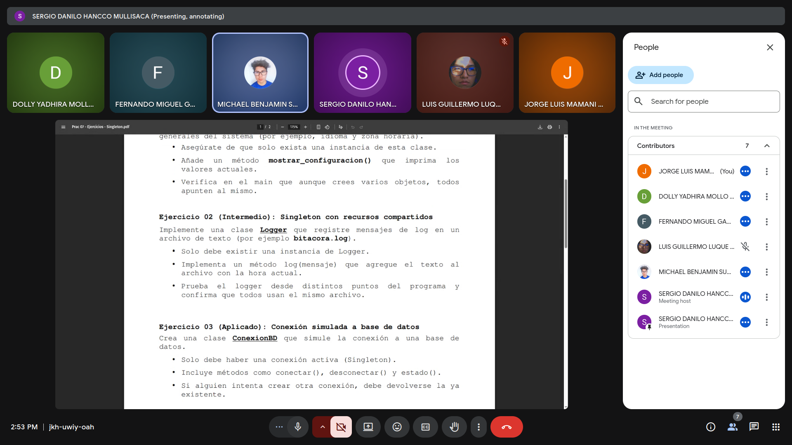
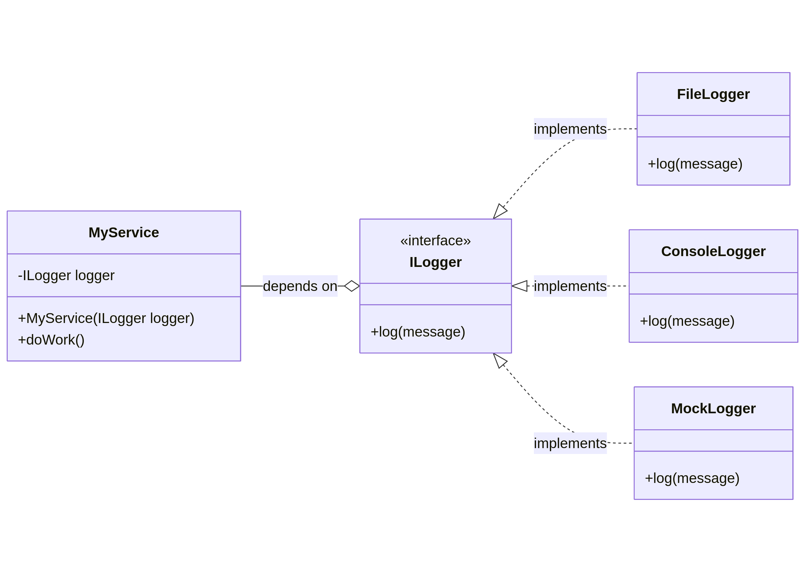
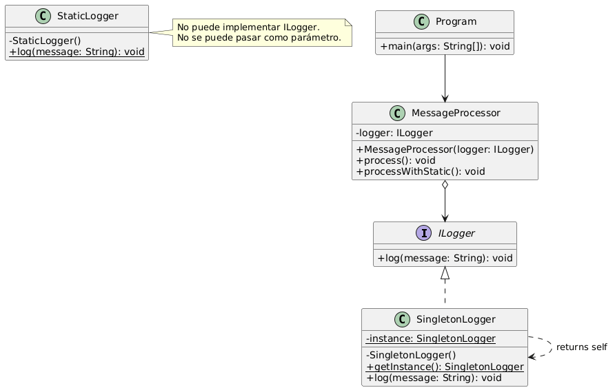

<div align="center">
<table>
    <theader>
        <tr>
            <td></td>
            <th>
                <span>UNIVERSIDAD NACIONAL DE SAN AGUSTIN</span><br />
                <span>FACULTAD DE INGENIERÍA DE PRODUCCIÓN Y SERVICIOS</span><br />
                <span>DEPARTAMENTO ACADÉMICO DE INGENIERÍA DE SISTEMAS E INFORMÁTICA</span><br />
                <span>ESCUELA PROFESIONAL DE INGENIERÍA DE SISTEMAS</span>
            </th>
            <td></td>
        </tr>
    </theader>
</table>
</div>

<div style="text-align: center; margin: 20px;">
  <table style="width: 80%; border-collapse: collapse; margin: 0 auto;">
    <tbody>
      <tr>
        <td style="padding: 10px; font-weight: bold;">ASIGNATURA:</td>
        <td colspan="5" style="padding: 10px;">Tecnología de objetos</td>
      </tr>
      <tr>
        <td style="padding: 10px; font-weight: bold;">PRÁCTICA:</td>
        <td colspan="5" style="padding: 10px;"> 07 - Patrón de diseño Singleton</td>
      </tr>
      <tr>
        <td style="padding: 10px; font-weight: bold;">FECHA DE PRESENTACIÓN:</td>
        <td style="padding: 10px;">12 de Noviembre, 2025</td>
        <td style="padding: 10px; font-weight: bold;">AÑO LECTIVO:</td>
        <td style="padding: 10px;">2025 B</td>
        <td style="padding: 10px; font-weight: bold;">NRO. SEMESTRE:</td>
        <td style="padding: 10px;">VI</td>
      </tr>
      <tr>
        <td colspan="6" style="padding: 10px; font-weight: bold;">DOCENTE:</td>
      </tr>
      <tr>
        <td colspan="6" style="padding: 10px;">Escobedo Quispe, Richart Smith</td>
      </tr>
      <tr>
        <td colspan="6" style="padding: 10px; font-weight: bold;">ESTUDIANTES:</td>
      </tr>
      <tr>
        <td colspan="6" style="padding: 10px;">
          Ajra Huacso, Jeans Anthony<br>
          Garambel Marín, Fernando Miguel<br>
          Hancco Mullisaca, Sergio Danilo<br>
          Luque Condori, Luis Guillermo<br>
          Mamani Huarsaya, Jorge Luis<br>
          Mollo Chuquicaña, Dolly Yadhira<br>
          Suclle Suca, Michael Benjamin<br>
      </tr>
    </tbody>
  </table>
</div>

# Evidencias

A continuación se muestra la reunión del equipo donde realizamos la
planificación y división de roles para realizar la práctica.



# Cuestionario

## 1. ¿Qué desventajas presenta el patrón Singleton en las pruebas unitarias?

La principal desventaja del patrón Singleton en las pruebas unitarias es que introduce **estado global y acoplamiento estrecho**, lo que atenta directamente contra los principios fundamentales de unas buenas pruebas unitarias: el **aislamiento** y la **repetibilidad**.

1.  **Violación del Aislamiento de las Pruebas (Test Isolation):**
    *   Las pruebas unitarias deben ser independientes entre sí. El resultado de una prueba no debe afectar a la siguiente. Un Singleton, al mantener un estado global y único, se convierte en un "vertedero de datos" compartido entre todas las pruebas.
    *   Si `TestA` modifica el estado del Singleton, `TestB` (que se ejecuta después) no comenzará con una instancia limpia, sino con la instancia ya modificada por `TestA`. Esto puede provocar fallos en cascada y resultados no deterministas, haciendo que el orden de ejecución de las pruebas sea relevante, lo cual es un grave anti-patrón de pruebas.

2.  **Dificultad para el "Mocking" y "Stubbing":**
    *   El "mocking" (simulación de objetos) es una técnica esencial para aislar la unidad bajo prueba de sus dependencias. Queremos reemplazar dependencias reales (como una base de datos o un servicio de red) por dobles de prueba.
    *   Dado que la instancia del Singleton se obtiene a través de un método estático (`getInstance()`), no podemos usar fácilmente técnicas como la inyección de dependencias para sustituir la instancia real por un mock. El código bajo prueba está fuertemente acoplado a la clase concreta del Singleton. Esto nos obliga a recurrir a técnicas de prueba más complejas y frágiles, como la reflexión o librerías especializadas que manipulan el bytecode.

3.  **Ocultamiento de Dependencias:**
    *   Un buen diseño de software hace que las dependencias de una clase sean explícitas (por ejemplo, a través de su constructor). El Singleton permite que una clase acceda a su instancia desde cualquier parte del código sin declararla como una dependencia.
    *   Esto dificulta la comprensión del código y de las pruebas. Al leer la firma de un método, no es evidente que depende del Singleton, lo que complica el razonamiento sobre su comportamiento y la configuración de las pruebas.

### Ejemplo del problema de aislamiento

```java
public class ConfigurationManager {
    private static ConfigurationManager instance;
    private String databaseUrl;

    private ConfigurationManager() {
        // En producción, se cargaría de un archivo
        this.databaseUrl = "jdbc:mysql://prod.db.com/main";
    }

    public static ConfigurationManager getInstance() {
        if (instance == null) {
            instance = new ConfigurationManager();
        }
        return instance;
    }

    public String getDatabaseUrl() { return this.databaseUrl; }
    public void setDatabaseUrl(String url) { this.databaseUrl = url; }

    // Método para resetear el estado
    public static void resetInstance() { instance = null; }
}

// Pruebas Unitarias
class OrderServiceTest {
    @Test
    public void testA_usesTestDatabase() {
        // Setup: Configuramos el Singleton para que use una BD de prueba
        ConfigurationManager.getInstance().setDatabaseUrl("jdbc:h2:mem:testdb");
        OrderService service = new OrderService(); // Internamente usa ConfigurationManager.getInstance()
        
        // Assert: Verificamos que el servicio se conecta a la BD de prueba
        assertEquals("jdbc:h2:mem:testdb", service.getActiveDbUrl());
    }

    @Test
    public void testB_usesDefaultProductionDatabase() {
        // Esta prueba asume un estado limpio, pero el Singleton fue modificado por testA.
        // Si se ejecuta después de testA, fallará.
        OrderService service = new OrderService();
        
        // Assert: Esperamos la URL de producción, pero obtendremos la de prueba.
        // ESTA PRUEBA FALLARÁ si testA se ejecutó antes.
        assertEquals("jdbc:mysql://prod.db.com/main", service.getActiveDbUrl()); 
    }
}
```

Para "solucionar" esto, los desarrolladores a menudo añaden métodos como `resetInstance()` al Singleton, lo que contamina el diseño de producción con artefactos exclusivos para las pruebas, una clara violación del principio de diseño.

## 2. ¿En qué casos no es recomendable usar el patrón Singleton?

No es recomendable usar el patrón Singleton en la mayoría de los escenarios de desarrollo de aplicaciones modernas, especialmente en aquellos que valoran la flexibilidad, la testeabilidad y la escalabilidad.

1.  **Cuando se requiere flexibilidad y polimorfismo:**
    *   El Singleton acopla el código a una implementación concreta. Si en el futuro necesitas diferentes implementaciones de esa funcionalidad (por ejemplo, un `FileLogger` y un `ConsoleLogger`), el Singleton se convierte en un obstáculo. Una estrategia basada en interfaces e inyección de dependencias es mucho más flexible.

2.  **En aplicaciones multi-hilo (concurrencia):**
    *   La implementación "ingenua" de un Singleton no es segura en entornos concurrentes (thread-safe). Se requieren técnicas como el bloqueo de doble verificación (`double-checked locking`) o inicializadores estáticos, lo que añade complejidad. Además, el estado mutable dentro de un Singleton en un entorno concurrente es una fuente común de errores difíciles de depurar (race conditions).

3.  **Cuando se viola el Principio de Responsabilidad Única (SRP):**
    *   Una clase Singleton asume dos responsabilidades: la lógica de negocio para la que fue creada (ej. logging, configuración) y la gestión de su propio ciclo de vida (garantizar que solo exista una instancia). Esto viola el SRP, que establece que una clase debe tener una única razón para cambiar.

4.  **En arquitecturas basadas en Inyección de Dependencias (DI) e Inversión de Control (IoC):**
    *   Los frameworks modernos (Spring, Angular, ASP.NET Core) gestionan el ciclo de vida de los objetos por nosotros. Podemos configurar un servicio para que tenga un "ámbito de singleton" (una única instancia por contenedor de DI) sin necesidad de implementar el patrón manualmente en nuestra clase. Esto nos da lo mejor de ambos mundos: una única instancia gestionada por el framework y un código desacoplado y fácil de probar.

### Alternativa superior al Singleton

Este diagrama ilustra cómo la Inyección de Dependencias resuelve el problema de acoplamiento. `MyService` no depende de `ConcreteLogger`, sino de la abstracción `ILogger`.



En las pruebas, simplemente inyectaríamos una instancia de `MockLogger` en `MyService`. En producción, inyectaríamos `FileLogger` o `ConsoleLogger`, según la configuración.


## 3. ¿Cuál es la diferencia entre un Singleton y una clase estática?

Aunque ambos parecen ofrecer un punto de acceso único a una funcionalidad, representan conceptos fundamentalmente diferentes en la programación orientada a objetos. Un Singleton es un **objeto**, mientras que una clase estática es una **colección de métodos y estado globales**.

### Tabla Comparativa

| Característica | Patrón Singleton | Clase Estática | Explicación Técnica |
| :--- | :--- | :--- | :--- |
| **Naturaleza** | Es una **instancia de un objeto**. Se crea un objeto en el heap como cualquier otro. | Es un contenedor de **miembros estáticos**. No se instancia; sus métodos y propiedades pertenecen a la clase misma. | El Singleton sigue los principios de la OO al ser un objeto. La clase estática se asemeja más a un enfoque de programación procedural. |
| **Estado** | Puede mantener un **estado de instancia** (variables no estáticas). | Solo puede mantener **estado estático** (variables estáticas), que son esencialmente variables globales. | El estado de un Singleton está ligado a su única instancia. El estado de una clase estática está ligado a la definición de la clase en el cargador de clases (ClassLoader). |
| **Herencia e Interfaces** | Una clase Singleton **puede heredar** de otras clases e **implementar interfaces**. | Una clase estática (en lenguajes como C#) **no puede heredar** ni **implementar interfaces**. En Java, no existe el concepto de "clase estática" como tal, pero una clase con solo miembros estáticos no puede usarse de forma polimórfica. | Esta es la diferencia más crucial. Al poder implementar una interfaz, la instancia del Singleton puede ser tratada polimórficamente, permitiendo la inversión de dependencias y facilitando (aunque no del todo) las pruebas. |
| **Inicialización** | Permite la **inicialización perezosa (lazy)**. La instancia se puede crear solo cuando se la necesita por primera vez. | La inicialización es generalmente **temprana (eager)**. La clase se carga e inicializa cuando el runtime la necesita por primera vez. | La inicialización perezosa puede ser beneficiosa si la creación del objeto es costosa y no siempre se necesita. |
| **Paso como Parámetro** | La instancia del Singleton **se puede pasar como parámetro** a otros métodos, especialmente si se usa una interfaz. | Una clase estática **no se puede pasar como parámetro**. Solo se puede acceder a sus métodos directamente por su nombre. | Poder pasar la instancia como parámetro hace las dependencias más explícitas y es clave para la Inyección de Dependencias. |


### Diferencia con interfaces



## Referencias

Feathers, M. C. (2004). *Working effectively with legacy code*. Prentice Hall.

Martin, R. C. (2008). *Clean code: A handbook of agile software craftsmanship*. Prentice Hall.

Hevery, M. (2008, October 8). *Singletons are evil* [Blog post]. *Google Testing Blog*. [https://testing.googleblog.com/2008/08/singletons-are-evil.html](https://testing.googleblog.com/2008/08/singletons-are-evil.html)

Gamma, E., Helm, R., Johnson, R., & Vlissides, J. (1994). *Design patterns: Elements of reusable object-oriented software*. Addison-Wesley Professional.

Microsoft. (n.d.). *Static classes and static class members (C# Programming Guide)*. Microsoft Learn. [https://learn.microsoft.com/en-us/dotnet/csharp/programming-guide/classes-and-structs/static-classes-and-static-class-members](https://learn.microsoft.com/en-us/dotnet/csharp/programming-guide/classes-and-structs/static-classes-and-static-class-members)

Bloch, J. (2018). *Effective Java* (3rd ed.). Addison-Wesley.
