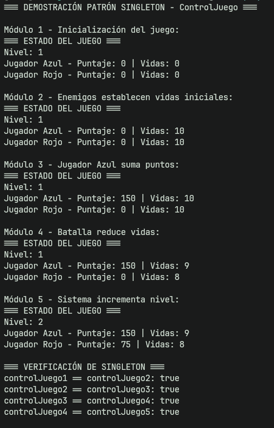
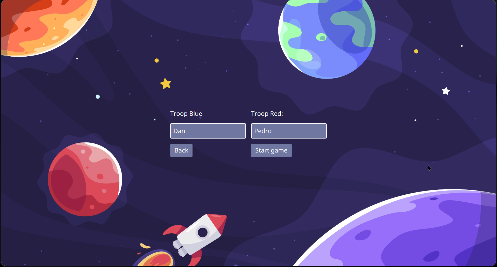
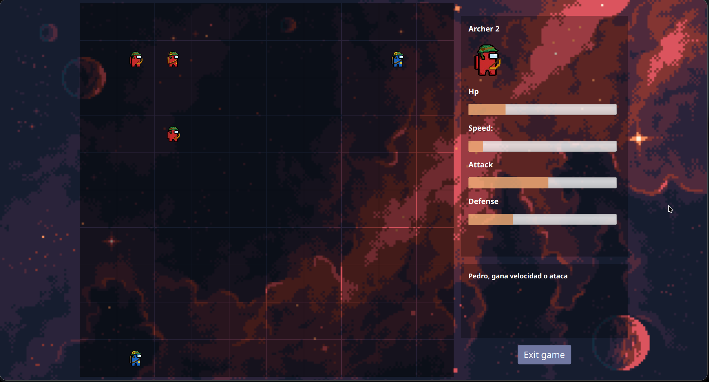
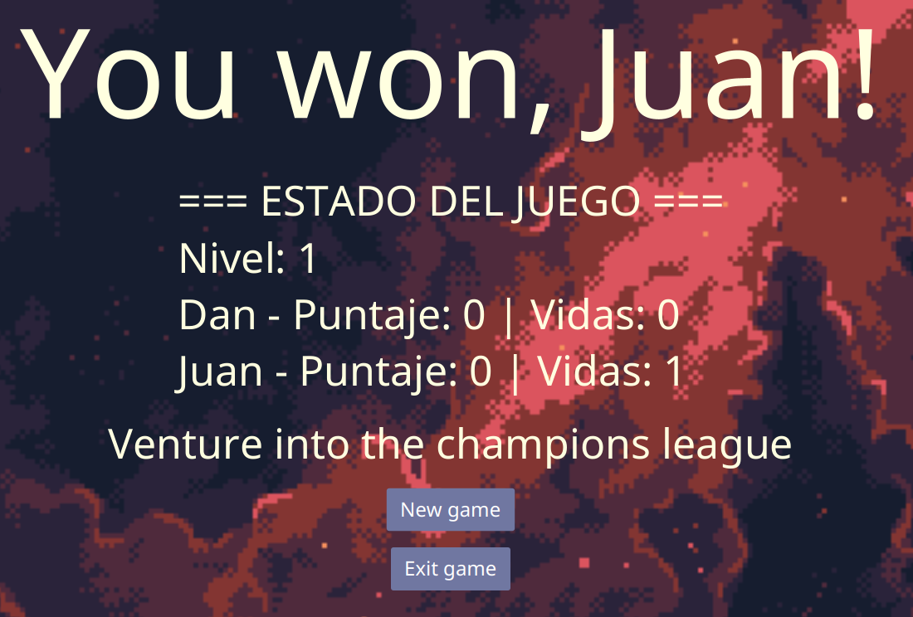

# Ejercicio 04: Singleton en un Juego (Deadly Speed)

## Descripción del Ejercicio

Desarrollar una clase `ControlJuego` para manejar el estado global de un juego (nivel actual, puntaje, vidas) usando el patrón **Singleton**, de manera que todos los componentes (jugador, enemigos, interfaz) consulten y modifiquen el mismo estado.

## Objetivos

- Implementar el patrón Singleton en un contexto real
- Demostrar cómo múltiples módulos acceden a la misma instancia
- Gestionar estado global del juego de forma centralizada

## Implementación

### Clase `ControlJuego` (Singleton)

**Ubicación:** `src/main/java/com/deadlyspeed/gameManager/ControlJuego.java`

#### Características del Singleton

1. **Constructor privado**: Impide la creación de instancias desde fuera de la clase
2. **Instancia estática**: Una única instancia compartida
3. **Método `getInstance()` sincronizado**: Thread-safe para evitar problemas de concurrencia

```java
private static ControlJuego instance;

private ControlJuego() {
    // Inicialización
}

public static synchronized ControlJuego getInstance() {
    if (instance == null) {
        instance = new ControlJuego();
    }
    return instance;
}
```

#### Estado del Juego Gestionado

- **Nivel actual**: `nivelActual`
- **Puntajes**: `puntajeJugadorAzul`, `puntajeJugadorRojo`
- **Vidas**: `vidasJugadorAzul`, `vidasJugadorRojo`
- **Nombres**: `nombreJugadorAzul`, `nombreJugadorRojo`

#### Métodos Principales

- `iniciarJuego(String jugadorAzul, String jugadorRojo)` - Inicializa una nueva partida
- `reiniciarJuego()` - Reset del estado
- `incrementarNivel()` - Sube el nivel
- `agregarPuntaje(String jugador, int puntos)` - Suma puntos
- `setVidas(String jugador, int vidas)` - Establece vidas
- `reducirVida(String jugador)` - Reduce una vida
- `getEstadoJuego()` - Retorna un resumen del estado completo

## Integración en el Juego

### 1. Clase `Game.java`

```java
// Inicializa el juego con el Singleton
ControlJuego.getInstance().iniciarJuego(playerBlue, playerRed);

// Muestra el estado al final del juego
Text gameState = new Text(ControlJuego.getInstance().getEstadoJuego());

// Reinicia el estado al iniciar nueva partida
ControlJuego.getInstance().reiniciarJuego();
```

### 2. Clase `RandomPlay.java`

```java
// Establece vidas iniciales según el número de guerreros
ControlJuego.getInstance().setVidas(player1, this.battle.getTroopBlue().size());
ControlJuego.getInstance().setVidas(player2, this.battle.getTroopRed().size());

// Reduce vidas cuando un guerrero muere
ControlJuego.getInstance().reducirVida(playerCurrent);
```

### 3. Clase `Main.java`

Demostración de cómo **diferentes módulos** acceden a la **misma instancia**:

```java
// Módulo 1: Inicialización
ControlJuego controlJuego1 = ControlJuego.getInstance();

// Módulo 2: Enemigos
ControlJuego controlJuego2 = ControlJuego.getInstance();

// Módulo 3: Jugador
ControlJuego controlJuego3 = ControlJuego.getInstance();

// TODAS LAS REFERENCIAS SON LA MISMA INSTANCIA
controlJuego1 == controlJuego2 == controlJuego3 // true
```

## Ejecución del Proyecto

### Prerrequisitos

- Java 17 o superior
- Maven 3.6+

### Compilar y ejecutar

```bash
mvn clean compile
mvn javafx:run
```

### Salida de la demostración

Al ejecutar el programa, verás en consola cómo los diferentes módulos interactúan con el mismo `ControlJuego`:



```
=== DEMOSTRACIÓN PATRÓN SINGLETON - ControlJuego ===

Módulo 1 - Inicialización del juego:
=== ESTADO DEL JUEGO ===
Nivel: 1
Jugador Azul - Puntaje: 0 | Vidas: 0
Jugador Rojo - Puntaje: 0 | Vidas: 0

Módulo 2 - Enemigos establecen vidas iniciales:
=== ESTADO DEL JUEGO ===
Nivel: 1
Jugador Azul - Puntaje: 0 | Vidas: 10
Jugador Rojo - Puntaje: 0 | Vidas: 10

...

=== VERIFICACIÓN DE SINGLETON ===
controlJuego1 == controlJuego2: true
controlJuego2 == controlJuego3: true
controlJuego3 == controlJuego4: true
controlJuego4 == controlJuego5: true

¡Todas las referencias apuntan a la MISMA instancia!
```

## Capturas del Juego

### Inicio de Nueva Partida



### Durante la Partida

Los jugadores controlan sus tropas en un tablero estratégico. El Singleton `ControlJuego` rastrea las vidas de cada guerrero en tiempo real.



### Pantalla de Victoria

Al finalizar el juego, se muestra el **estado completo** obtenido del Singleton, incluyendo nivel, puntajes y vidas restantes.



## Ventajas del Patrón Singleton en este Proyecto

1. **Estado centralizado**: Un único punto de verdad para el estado del juego
2. **Consistencia**: Todos los componentes ven los mismos datos
3. **Acceso global**: Cualquier módulo puede consultar el estado sin pasarlo por parámetros
4. **Control de concurrencia**: El método `synchronized` evita condiciones de carrera
5. **Facilita debugging**: Un solo lugar para monitorear el estado

## Otros Singletons en el Proyecto

Este proyecto también implementa Singleton en:

- **`ConnectionDB`**: Gestión de la conexión a base de datos
- **`Lobby`**: Manejo del lobby principal
- **`League`**: Gestión de la liga

## Conclusión

La implementación del patrón Singleton en `ControlJuego` demuestra cómo gestionar eficientemente el estado global de un juego, permitiendo que múltiples componentes (interfaz, lógica de juego, enemigos) accedan y modifiquen el mismo estado de forma sincronizada y consistente.
