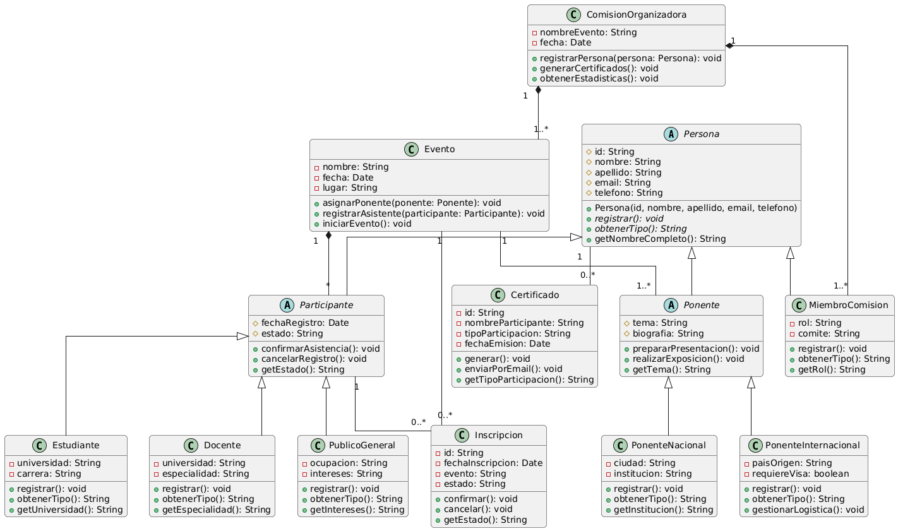

<h1 align="center">
   
  Sistema de Gestión de Eventos Académicos
   
  
   
</h1>

<h4 align="center">
  Proyecto académico basado en el <i>III Seminario Internacional de Ingeniería de Software</i>, 
  desarrollado en <b>Java</b> para la gestión de eventos, inscripciones y certificados.
</h4>

  
  
  

---

## Clases Principales

### 1. Gestión de Eventos
- **Clase:** `Evento`  
- **Descripción:** Permite crear y administrar seminarios.  
- **Atributos principales:**  
  - `nombre`  
  - `fecha`  
  - `lugar`  
  - `listaAsistentes`  
- **Responsabilidades:** Registrar, actualizar y listar eventos académicos.

---

### 2. Gestión de Participantes
El sistema distingue varios tipos de participantes mediante **herencia** a partir de la clase base `Participante`.

- **Clase base:** `Participante`  
  - Atributos: `nombre`, `dni`, `email`, `tipoParticipacion`  

#### Subclases:
- **`Estudiante`** → Atributos: `universidad`, `carrera`  
- **`Docente`** → Atributos: `universidad`, `especialidad`  
- **`PublicoGeneral`** → Atributos: `ocupacion`, `intereses`  
- **`PonenteNacional`** → Atributos: `especializacion`, `institucion`  
- **`PonenteInternacional`** → Atributos: `especializacion`, `paisOrigen`  

---

### 3. Gestión de Inscripciones y Certificados
- **Clase:** `Inscripcion`  
  - Relaciona un `Participante` con un `Evento`.  
  - Atributos: `fechaInscripcion`, `estado`, `tipoParticipacion`  
- **Clase:** `Certificado`  
  - Generado automáticamente tras la participación validada.  
  - Atributos: `codigo`, `fechaEmision`, `tipoCertificado`  

---

### 4. Administración
- **Clase:** `ComisionOrganizadora`  
  - Coordina el registro de participantes y eventos.  
  - Gestiona la emisión de certificados y el control de estadísticas.  
  - Atributos: `miembros`, `cargo`, `responsabilidades`  

